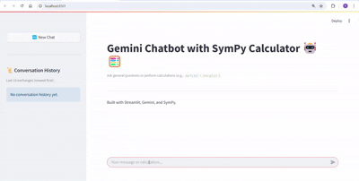

# MathMateChatbot 🤖🧮  

A hybrid chatbot that intelligently routes queries between Google's Gemini for conversation and SymPy for precise mathematical computations. Perfect for students, engineers, and researchers needing both AI chat and computational power.

---

## **Table of Contents**
- [How It Works](#how-it-works)
- [Key Features](#key-features)
- [Setup Instructions](#setup-instructions)
- [Demo](#-demo)
- [Project Structure](#project-structure)
- [Future Work](#future-work)
- [License](#license)

---

## **How It Works**

The chatbot follows a smart decision pipeline:

1. **Input Analysis**  
   - Uses regex patterns and keyword matching to detect math expressions
   - Example triggers: `calculate`, `solve`, `integrate`, or presence of operators (`+`, `^`, `∫`)

2. **Execution Flow**  
   ```mermaid
   graph TD
     A[User Input] --> B{Is Math?}
     B -->|Yes| C[Process with SymPy]
     B -->|No| D[Send to Gemini]
     C --> E[Show Result + Explanation Button]
     D --> F[Display Gemini Response]
   ```

3. **Safety Checks**  
   - Whitelists allowed math functions (`sin`, `log`, etc.)
   - Blocks dangerous symbols using regex: `r"(_|import|exec|eval)"`

4. **Response Generation**  
   - SymPy results appear instantly
   - Gemini explanations available on-demand via "Show LLM Answer" button

---

## **Key Features**  

| Feature | Implementation | Example |
|---------|---------------|---------|
| **Smart Routing** | Hybrid Gemini/SymPy backend | `solve(x²=4)` → SymPy |
| **Math Support** | 100+ SymPy functions | `derivative(exp(x),x)` |
| **Explanations** | Gemini-generated steps | "First we take the derivative of e^x..." |
| **Session Safety** | Isolated math sandbox | Blocks `import os` |
| **History** | Streamlit session state | Track last 10 exchanges |

---

## **Setup Instructions**  

1. **Prerequisites**  
   - Python 3.9+
   - Google Gemini API key

2. **Installation**  
   ```bash
   git clone https://github.com/yourusername/gemini-sympy-chatbot.git
   cd gemini-sympy-chatbot
   pip install -r requirements.txt
   ```

3. **Configuration**  
   Add to `.env`:
   ```env
   GEMINI_API_KEY=your_key_here  # From Google AI Studio
   ```

4. **Launch**  
   ```bash
   python main.py  # Starts on http://localhost:8501
   ```

---

## 🎥 **Demo**  
**Sample Interactions:**  
1. Calculation:  
   `Input`: "Calculate ∫(sin(x) + 2x) dx from 0 to π"  
   `Output`: "🧮 SymPy Result: 2 + π²"  

2. Demo:  
<<<<<<< HEAD
     
=======
     
>>>>>>> 87b15ad0c2c51eee5ab7a8a8ec827a28a3989bdf

---

## **Project Structure**  

```
gemini-sympy-chatbot/  
├── ui/  
│   └── app.py          # Streamlit frontend UI  
├── calculator.py       # SymPy-based math engine  
├── chat_utils.py       # Gemini API integration  
├── main.py             # App launcher  
├── config.py           # Gemini model settings  
├── requirements.txt    # Dependencies  
└── assests/  
<<<<<<< HEAD
    └── demoSymPy.gif   # Demo video  
=======
    └── demoSymPy.mp4   # Demo video  
>>>>>>> 87b15ad0c2c51eee5ab7a8a8ec827a28a3989bdf
```

---

## **Future Work**  

**Priority Roadmap**  
   - Matrix operations (`inv([[1,2],[3,4]]`)  
   - Equation plotting (`plot(sin(x))`)   
   - PDF/Image math input  
   - User profiles
   - Support for differential equations and statistical distributions.
   - UI inhancements

---

## **License**  
MIT © 2025 - Free for academic and commercial use with attribution.

---
